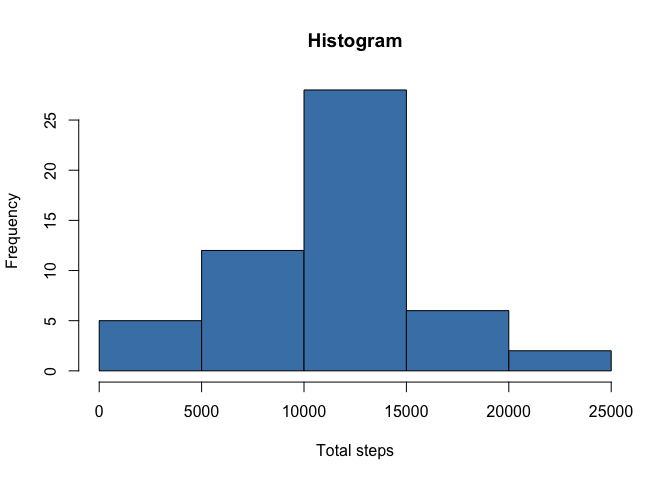
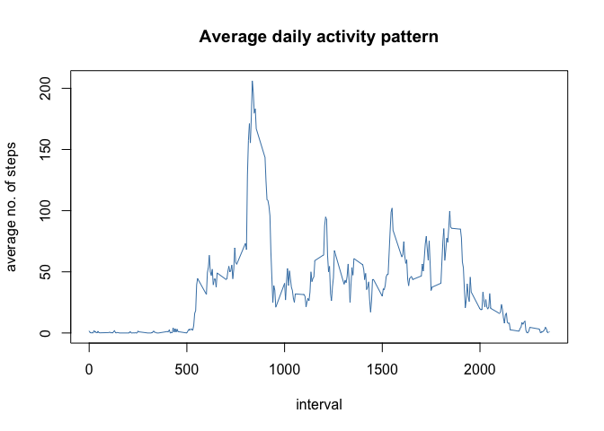
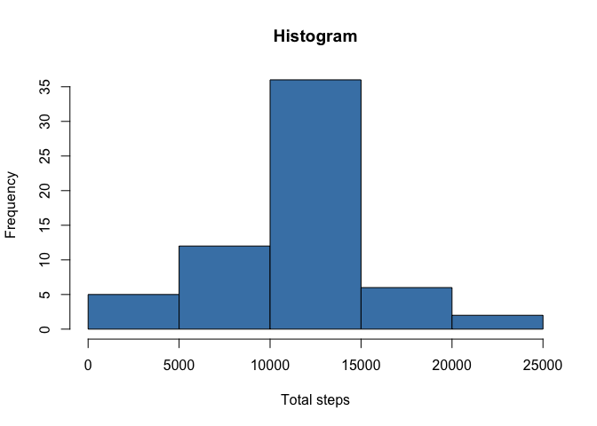
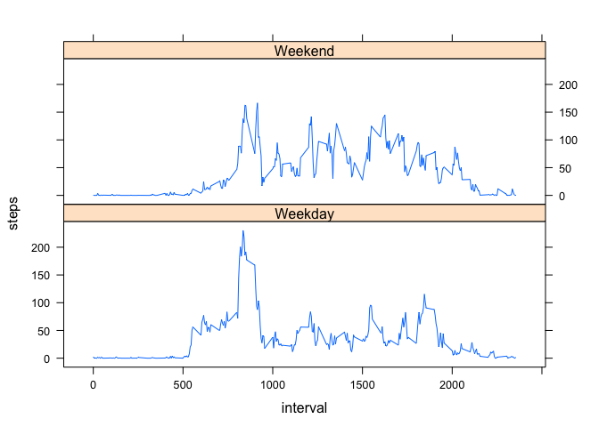

# Reproducible Research: Peer Assessment 1


## Loading and preprocessing the data

1. Make sure you set the correct path to your working directory

```r
setwd("../RepData_PeerAssessment1/")
```

2. List the files in the working directory and make sure you have the *zip* file called `activity.zip`

```r
zipFile = list.files(pattern = "*.zip")
zipFile
```

```
## [1] "activity.zip"
```
3. If the output at the previous step is correct, unzip `activity.zip` and make sure you have the csv file

```r
unzip(zipFile)
csvFile = list.files(pattern = "*.csv")
csvFile
```

```
## [1] "activity.csv"
```
4. Now is time to load the file

```r
csv = read.csv(csvFile)
str(csv)
```

```
## 'data.frame':	17568 obs. of  3 variables:
##  $ steps   : int  NA NA NA NA NA NA NA NA NA NA ...
##  $ date    : Factor w/ 61 levels "2012-10-01","2012-10-02",..: 1 1 1 1 1 1 1 1 1 1 ...
##  $ interval: int  0 5 10 15 20 25 30 35 40 45 ...
```
5. The `date` variable in the data set needs to be formatted appropriately

```r
csv$date = as.Date(csv$date)
```

6. Clean the `NA` values from the data set

```r
cleanFile = csv[!is.na(csv$steps), ]
```
7. The result - see the difference between step 4 and 7

```r
str(cleanFile)
```

```
## 'data.frame':	15264 obs. of  3 variables:
##  $ steps   : int  0 0 0 0 0 0 0 0 0 0 ...
##  $ date    : Date, format: "2012-10-02" "2012-10-02" ...
##  $ interval: int  0 5 10 15 20 25 30 35 40 45 ...
```

## What is mean total number of steps taken per day?

1. Make a histogram of the total number of steps taken each day.

```r
byDate = ddply(cleanFile, ~date, summarise, sum = sum(steps))
hist(byDate$sum, xlab = "Total steps", col = "steelblue", main = "Histogram")
```

 

2 Calculate and report the **mean** and **median** total number of steps taken per day.

```r
# Mean
mean(byDate$sum)
```

```
## [1] 10766.19
```

```r
# Median
median(byDate$sum)
```

```
## [1] 10765
```


## What is the average daily activity pattern?

1. Make a time series plot (i.e. type = "l") of the 5-minute interval (x-axis) and the average number of steps taken, averaged across all days (y-axis)


```r
byInterval = ddply(cleanFile, ~interval, summarise, mean = mean(steps))
with(byInterval, plot(interval, mean, type = "l", xlab = "interval", ylab = "average no. of steps", 
    main = "Average daily activity pattern", col = "steelblue"))
```

 

2. Which 5-minute interval, on average across all the days in the data set, contains the maximum number of steps?

```r
maxValue = max(byInterval$mean)  # what is the max value in the data set
maxLine = byInterval[byInterval$mean == maxValue, ]  # which line contains that value
print(maxLine$interval)  # the interval
```

```
## [1] 835
```


## Imputing missing values

1. Calculate and report the total number of missing values in the data set (i.e. the total number of rows with `NAs`)

```r
sum(is.na(csv))
```

```
## [1] 2304
```

2. Devise a strategy for filling in all of the missing values in the data set. The strategy does not need to be sophisticated. For example, you could use the mean/median for that day, or the mean for that 5-minute interval, etc.  
*- I will use the average for the interval - variable `byInterval`*

3. Create a new data set that is equal to the original data set but with the missing data filled in.

```r
newCsv = csv  # copy the original data set
missingData = is.na(newCsv$steps)  # these are all the missing observations in the data set
newCsv$interval = factor(newCsv$interval)  # convert int to factors
byInterval$interval = factor(byInterval$interval)  # convert int to factors

newCsv[missingData, "steps"] = byInterval[newCsv[missingData, "interval"], "mean"]  # fill in the missing data
```

4. Make a histogram of the total number of steps taken each day and calculate and report the **mean** and **median** total number of steps taken per day. Do these values differ from the estimates from the first part of the assignment? What is the impact of imputing missing data on the estimates of the total daily number of steps?


```r
byDate1 = ddply(newCsv, ~date, summarise, sum = sum(steps))
hist(byDate1$sum, xlab = "Total steps", col = "steelblue", main = "Histogram")
```

 

```r
# Mean - is unchanged
mean(byDate1$sum)
```

```
## [1] 10766.19
```

```r
# Median - increased with 1.19
median(byDate1$sum)
```

```
## [1] 10766.19
```


## Are there differences in activity patterns between weekdays and weekends?

1. Create a new factor variable in the dataset with two levels -- "weekday" and "weekend" indicating whether a given date is a weekday or weekend day.

```r
# weekday or weekend based on the day
newCsv$weekday = ifelse(weekdays(newCsv$date) == "Saturday" | weekdays(newCsv$date) == 
    "Sunday", "Weekend", "Weekday")
newCsv$weekday = factor(newCsv$weekday)  # make it factor
str(newCsv)
```

```
## 'data.frame':	17568 obs. of  4 variables:
##  $ steps   : num  1.717 0.3396 0.1321 0.1509 0.0755 ...
##  $ date    : Date, format: "2012-10-01" "2012-10-01" ...
##  $ interval: Factor w/ 288 levels "0","5","10","15",..: 1 2 3 4 5 6 7 8 9 10 ...
##  $ weekday : Factor w/ 2 levels "Weekday","Weekend": 1 1 1 1 1 1 1 1 1 1 ...
```

2. Make a panel plot containing a time series plot (i.e. type = "l") of the 5-minute interval (x-axis) and the average number of steps taken, averaged across all weekday days or weekend days (y-axis).

```r
# group the data by weekday and interval
byWeekdayInterval = ddply(newCsv, ~interval + weekday, summarise, mean = mean(steps))

byWeekdayInterval$interval = as.numeric(as.character(byWeekdayInterval$interval))  # if I don't do this I will get all the level values on the X axis
xyplot(mean ~ interval | weekday, byWeekdayInterval, type = "l", layout = c(1, 
    2), xlab = "interval", ylab = "steps")
```

 
